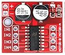

# FS_MX1508 library
Arduino library for MX1508 dual DC motor driver compatible with ESP8266, ESP32 (core release 3.x.y or 2.x.y), Arduino classic AVR boards (UNO, PRO Mini, ...), RP2040.  
It is based only on the analogWrite API of the Arduino environment and should work with the architectures supporting this API.   

**It can be used also with a lot of simple H-Bridge DC Motor Drivers using two input pins** (such as DRV8871, RZ7886, TC118SS,  etc...)   

 

The MX1508 Motor Driver provides an integrated dual brushed DC low cost motor drive solution with a wide operating voltage range (2-9.6V) and a maximum peak output current of 1.5A.   
   
This library was inspired by [the MX1508 AVR only Library](https://github.com/Saeterncj/MX1508) from Cheng Saetern (Saeterncj)  
For convenience, you will find in the doc subdirectory an [English translation of the original MX1508 datasheet.](doc/mx1208_en.pdf) (Thanks Google :blush:)
## Main features

 - simple interface, managing **forward/backward** direction of rotation, **braking/coasting**
 - support **SLOW_DECAY** and **FAST_DECAY** mode
 - support configuration using **only one pwm pin** (**PWM_1PIN**, allowing nevertheless forward/backward) for architecture with just a few pwm pins (AVR)

## Driving mode SLOW_DECAY, FAST_DECAY, PWM_1PIN
Adafruit made a nice tutorial on brushed DC motors, with explanation of  [**decay mode**](https://learn.adafruit.com/improve-brushed-dc-motor-performance/current-decay-mode)
 - **SLOW_DECAY** (referenced as PWM mode B in the datasheet)
   - linear response     
    - motor start sooner with lower pwm values
    -  less aggressive 
- **FAST_DECAY** (referenced as PWM mode A in the datasheet)
   - not linear response
   - motor start latter
   - more aggressive
 - **PWM_1PIN**  
     When pwm enabled pins are rare and limited resources, with the driving mode **1PWM_1PIN** it is however possible to use only one  pwm pin, the other one being any simple digital only pin. The motor can still be driven forward/backward with speed control but will a huge tradeoff: forward will be in  fast_decay mode and backward in slow_decay mode.  
This mode is of no interest for ESP8266, ESP32 ... but may be interesting with AVR processor where pwm pins are limited.  
With this mode, you can for example drive 2 motors forward/backward, with speed control with a ATtiny85.  
   The following graphics show the differences:
  
  
  
  

## MX1508 class

    MX1508(uint8_t pinIN1, uint8_t pinIN2, DecayMode decayMode = SLOW_DECAY);
    void motorGo(int32_t pwmVal);  // from -(2**pwmResolution-1) to (2**pwmResolution-1)
    void motorGoP(int8_t pwmPercent);  // -100 to 100 in percent.
    void motorStop();
    void motorBrake(uint8_t pwmPercent = 100);  //  from 0 to 100 in percent
    int32_t getPWM();
    void setResolution(uint32_t bitsResolution); 
    void setFrequency(uint32_t pwmFrequency); // in Hz
    

## Constructor
     MX1508(uint8_t pinIN1, uint8_t pinIN2, DecayMode decayMode = SLOW_DECAY);
 + pinIN1 and pinIN2: output pins  connected to MX1508 board IN1 and IN2
 + DecayMode must be FAST_DECAY or SLOW_DECAY, or PWM_1PIN

 In FAST_DECAY or SLOW_DECAY mode, both pinIN1 and pinI2 must be pwm capable pins.  
 In PWM_1PIN mode the first pin pinIN1 must be a pwm capable pin, the second one pinIN2 being any output pin.  
 Default pwm frequency is 1000khz, with an 8 bit resolution (giving a range 0 to 255)   
 Example:  

     MX508 motorA(17,18); // pwm pin 17, 18, default SLOW_DECAY mode

 
## Methods and Functions
  + motorGo(pwmVal)
    - This sets the PWM value (related to the speed, range depending on selected resolution 0-255 per default)
    - positive value: forward.  Default: 0 to 255
    - negative value: reverse. Default  0 to -255
   - motorGoP(pwmPercent)
       - set the PWM value to the given percentage of the full pwm range
       - positive value: forward. 
      - negative value: reverse.
  + stopMotor()
    - Simply stops the motor. It will stop rotating slowly. (Freewheel)
  +  motorBrake(pwmPercent)
     -  Actively brakes the motor.  It will stop rotating in a short time.
     - The efficiency of the break can be controlled from 0 to 100%
     - motorBrake(): full brake (equivalent to motorBrake(100))
     -  after a break session it is better to return to a simple motorStop() in order to avoid static power  consumption.
     
 + getPWM()
     - return the last pwmVal used in a call to motorGo
  + setResolution(bitsResolution)
    - It is possible to change the resolution (range) of the pwm signal.
    - Theoretically, the value can be anywhere from 2 to 32 .....

    - the range for the pwm value will be -2\**bitsResolution-1 to 2**bitsResolution-1
     -  Default is 8  (giving a range -255 to +255).
   + setFrequency (pwmFrequency)
      -  Set the frequency of the pwm signal, in Hz
      -  Default value is 1000hz (excepted for AVR. See here after)
    
setFrequency and setResolution are not used with AVR architecture (UNO, Pro Mini, ATTiny boards) and will simply return. The resolution is 8, giving a range from -255 to 255) and the frequency will depend on the PWM pins used (see analogWrite / pwm reference documentation for Arduino).  
For other architecture, the default pwm frequency is 1000Hz.  
Changing the pwm frequency when driving a motor seems of little interest, and usually the default value will do.  

